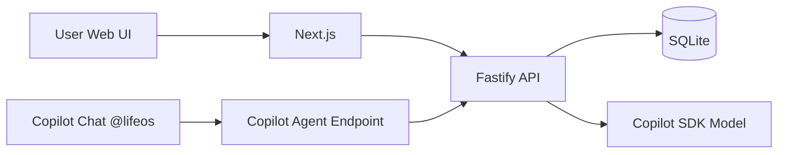

# 02. Architecture

## 1) 기술 스택

- Frontend: Next.js (TypeScript)
- Backend: Node.js + Fastify (TypeScript)
- AI Agent: Copilot Extensions/Agents SDK (`@copilot-extensions/preview-sdk`)
- DB: SQLite (대회 MVP)
- Deploy: Azure Container Apps 또는 Azure App Service

## 2) 시스템 구성



설명

- 웹 UI와 Copilot Chat은 같은 백엔드 로직을 공유
- 핵심 AI 로직은 단일 서비스 함수로 통합해 중복 제거

## 3) 도메인 모델

### Item

- `id: string`
- `type: "work" | "career" | "tech"`
- `text: string`
- `dueDate?: string`
- `createdAt: string`

### Insight

- `id: string`
- `summary: string`
- `topActions: Action[]`
- `risks: string[]`
- `generatedAt: string`

### Action

- `id: string`
- `title: string`
- `reason: string`
- `priority: 1 | 2 | 3`
- `estimateMin: number`
- `done: boolean`

### PlanBlock

- `id: string`
- `actionId: string`
- `startAt: string`
- `durationMin: number`

## 4) API 계약 (MVP)

### POST /api/analyze

요청

```json
{
  "brainDump": "회의 준비, 이력서 수정, 시스템 디자인 공부",
  "timeBudgetMin": 120
}
```

응답

```json
{
  "summary": "오늘은 마감 리스크가 있는 업무를 우선 처리해야 합니다.",
  "topActions": [
    {
      "id": "a1",
      "title": "회의 아젠다 확정",
      "reason": "당일 영향도가 가장 큼",
      "priority": 1,
      "estimateMin": 45,
      "done": false
    }
  ],
  "planBlocks": [
    {
      "id": "p1",
      "actionId": "a1",
      "startAt": "2026-06-20T09:00:00+09:00",
      "durationMin": 45
    }
  ],
  "risks": ["이력서 수정이 이번 주 목표 대비 지연 중"]
}
```

### POST /api/actions

- 액션 저장

### PATCH /api/actions/:id

- 완료 토글

### POST /api/replan

- 남은 시간 기준 재계획

## 5) AI 출력 강제 전략

- Zod 또는 JSON schema로 구조화 응답 강제
- 1회 재시도 후 실패 시 fallback
- fallback: 원문 기반 기본 액션 1~3개 생성

## 6) 보안/운영

- GitHub App 시크릿/키는 환경변수로 주입
- Agent 엔드포인트 요청 서명 검증 적용
- 구조화 로그 필드
- `requestId`, `route`, `latencyMs`, `model`, `errorCode`

## 7) 병렬 개발 합의 포인트

- FE/BE 공통 타입을 `shared/schema.ts`에서 관리
- 목 응답 JSON 파일을 기준으로 FE 선개발
- API 완성 후 타입 동기화 + 계약 테스트
