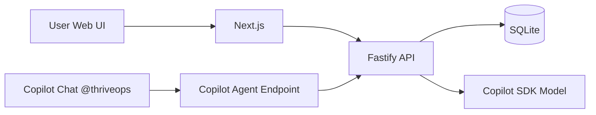

# 02. Architecture

## 1) 기술 스택

- Frontend: Next.js (TypeScript)
- Backend: Node.js + Fastify (TypeScript)
- AI Agent: Copilot Extensions/Agents SDK (`@copilot-extensions/preview-sdk`)
- DB: SQLite (대회 MVP)
- Deploy: Azure Container Apps 또는 Azure App Service

## 2) 시스템 구성



설명

- 웹 UI와 Copilot Chat은 같은 백엔드 로직을 공유
- 핵심 AI 로직은 단일 서비스 함수로 통합해 중복 제거

## 3) 도메인 모델

### Item

- `id: string`
- `type: "work" | "career" | "tech"`
- `text: string`
- `dueDate?: string`
- `createdAt: string`

### Insight

- `id: string`
- `summary: string`
- `topActions: Action[]`
- `risks: string[]`
- `generatedAt: string`

### Action

- `id: string`
- `title: string`
- `reason: string`
- `priority: 1 | 2 | 3`
- `estimateMin: number`
- `done: boolean`

### PlanBlock

- `id: string`
- `actionId: string`
- `startAt: string`
- `durationMin: number`

### JobPosting (채용 공고)

- `id: string`
- `company: string`
- `title: string`
- `rawText: string`
- `skills: string[]` (추출된 요구 역량)
- `seededAt: string`

### SkillRequirement (요구 역량)

- `id: string`
- `name: string`
- `demandCount: number` (사전 설정 공고 중 요구 빈도)
- `sourceJobIds: string[]`

### KnowledgeEntry (지식기반 항목)

- `id: string`
- `title: string`
- `content: string`
- `tags: string[]`
- `sourceProblemId?: string` (해결 과정에서 파생된 경우)
- `createdAt: string`
- `updatedAt: string`

### LearningCycle (자동 반복 학습 루프 1회)

- `id: string`
- `problem: string`
- `usedKnowledgeIds: string[]` (해결에 활용한 지식)
- `newKnowledgeIds: string[]` (축적된 신규 지식)
- `matchedSkills: string[]` (채용 공고 역량과 매칭)
- `ranAt: string`

### UserProfile (사용자 컨텍스트)

- `id: string`
- `name: string` (로그인 기준 식별자)
- `createdAt: string`
- `updatedAt: string`

### ConversationSession (대화 세션)

- `id: string`
- `userId: string`
- `title: string`
- `startedAt: string`
- `updatedAt: string`

### ConversationTurn (대화 턴)

- `id: string`
- `sessionId: string`
- `role: "user" | "assistant"`
- `message: string`
- `intent: "add" | "update" | "delete" | "insight" | "query"`
- `createdAt: string`

### InsightNote (대화 기반 인사이트)

- `id: string`
- `userId: string`
- `summary: string`
- `evidence: string[]` (업무/커리어 데이터 근거)
- `recommendedActions: string[]`
- `createdAt: string`

### ActivityEvent (추적 로그)

- `id: string`
- `userId: string`
- `sessionId?: string`
- `eventType: "task_changed" | "job_changed" | "insight_added"`
- `targetId: string`
- `payload: object`
- `createdAt: string`

## 4) API 계약 (MVP)

### POST /api/analyze

요청

```json
{
  "brainDump": "회의 준비, 이력서 수정, 시스템 디자인 공부",
  "timeBudgetMin": 120
}
```

응답

```json
{
  "summary": "오늘은 마감 리스크가 있는 업무를 우선 처리해야 합니다.",
  "topActions": [
    {
      "id": "a1",
      "title": "회의 아젠다 확정",
      "reason": "당일 영향도가 가장 큼",
      "priority": 1,
      "estimateMin": 45,
      "done": false
    }
  ],
  "planBlocks": [
    {
      "id": "p1",
      "actionId": "a1",
      "startAt": "2026-06-20T09:00:00+09:00",
      "durationMin": 45
    }
  ],
  "risks": ["이력서 수정이 이번 주 목표 대비 지연 중"]
}
```

### POST /api/actions

- 액션 저장

### PATCH /api/actions/:id

- 완료 토글

### POST /api/replan

- 남은 시간 기준 재계획

### GET /api/jobs/skills

- 사전 설정된 약 10개 회사 채용 공고에서 추출한 요구 역량 집계 반환
- 응답: `SkillRequirement[]` (역량명 + 요구 빈도 + 출처 공고)

### POST /api/knowledge/solve

- 입력 문제를 기존 지식기반으로 해결 시도
- 해결 결과 + 활용 지식 + 신규 축적 지식을 함께 반환
- 동작: 지식기반 검색 → 해결안 생성 → 신규 지식 `KnowledgeEntry`로 축적

### GET /api/knowledge

- 누적된 지식기반 항목 조회 (검색/태그 필터)

### POST /api/loop/run

- 역량 분석 → 문제 해결 → 지식 축적 과정을 1회 실행하고 `LearningCycle` 기록 반환
- 반복 실행 시 지식기반과 커리어 역량 매칭이 함께 누적됨

### POST /api/agent/chat

- 사용자 대화 입력을 받아 intent 추론 후 업무/커리어/인사이트를 갱신
- 응답: `reply`, `appliedChanges[]`, `insight?`, `updatedContext`

요청 예시

```json
{
  "name": "지예",
  "message": "이번 주 채용공고 중 프론트엔드만 추려서 인사이트 추가해줘"
}
```

응답 예시

```json
{
  "reply": "프론트엔드 공고 3건을 기준으로 인사이트를 추가했습니다.",
  "appliedChanges": [
    { "type": "job_filter", "count": 3 },
    { "type": "insight_added", "id": "insight-1" }
  ],
  "insight": {
    "id": "insight-1",
    "summary": "React/TypeScript 요구 비중이 높습니다.",
    "evidence": ["job-1", "job-3", "job-5"],
    "recommendedActions": ["다음 주 UI 성능 개선 사례 정리"]
  }
}
```

### GET /api/agent/context?name={name}

- 이름 기준 사용자 컨텍스트(최근 업무/커리어/인사이트/대화 요약) 반환

### GET /api/events?name={name}

- 대화로 인해 발생한 데이터 변경 이력 조회

## 5) AI 출력 강제 전략

- Zod 또는 JSON schema로 구조화 응답 강제
- 1회 재시도 후 실패 시 fallback
- fallback: 원문 기반 기본 액션 1~3개 생성
- 대화형 명령은 intent + target + patch 형태의 구조화 JSON으로 제한

## 6) 보안/운영

- GitHub App 시크릿/키는 환경변수로 주입
- Agent 엔드포인트 요청 서명 검증 적용
- 구조화 로그 필드
- `requestId`, `route`, `latencyMs`, `model`, `errorCode`

## 7) 병렬 개발 합의 포인트

- FE/BE 공통 타입을 `shared/schema.ts`에서 관리
- 목 응답 JSON 파일을 기준으로 FE 선개발
- API 완성 후 타입 동기화 + 계약 테스트
