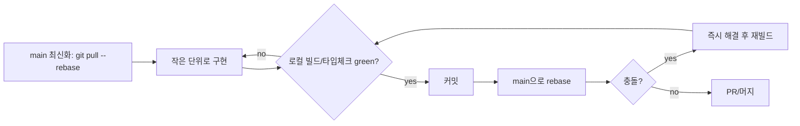

# 09. 멀티 에이전트 협업 전략

여러 AI 에이전트(Copilot/Claude 등)가 autopilot 모드로 동시에 작업하면, 같은 파일을 동시에 고치거나 빌드가 깨진 상태가 공유 브랜치로 흘러가 전체 작업이 멈출 수 있습니다. 이 문서는 충돌을 구조적으로 막고, 깨지면 빠르게 복구하기 위한 규칙을 정의합니다.

## 0) 핵심 원칙

1. **공유 계약을 먼저 동결한다** — API/타입이 합의되기 전에는 구현을 시작하지 않는다.
2. **에이전트는 자기 worktree/브랜치에서만 작업한다** — 다른 트랙의 파일은 건드리지 않는다.
3. **깨진 빌드를 공유 브랜치에 올리지 않는다** — main은 항상 green 상태를 유지한다.
4. **깨지면 즉시 fix-forward 또는 revert** — "나중에 고치자"는 금지. 멈추지 말고 바로 복구한다.

## 1) 트랙과 소유권 경계

각 에이전트는 하나의 트랙을 맡고, 그 트랙의 디렉터리만 소유합니다. 소유 경계 밖 파일은 읽기만 가능합니다.

| 트랙 | 소유 디렉터리 | 브랜치 prefix |
| --- | --- | --- |
| FE | `frontend/` | `feat/fe-*` |
| BE | `backend/` | `feat/be-*` |
| 통합/배포 | `infra/`, `deploy/`, CI 설정 | `feat/ops-*` |
| 공유 계약 | `shared/` (타입·스키마) | `contract/*` |

규칙:

- `shared/`는 **한 번에 한 에이전트만** 편집한다. 변경 시 PR 제목에 `[contract]`를 붙이고 즉시 머지해 모두가 rebase하게 한다.
- 소유 경계 밖 파일을 꼭 바꿔야 하면, 직접 고치지 말고 해당 트랙 담당에게 요청(이슈/코멘트)한다.

## 2) git worktree 분리 운영

에이전트별로 물리적 작업 디렉터리를 분리해, 동시 편집·체크아웃 충돌을 원천 차단합니다.

```bash
# 최초 1회: main을 깨끗한 베이스로 둠
git switch main && git pull

# 트랙별 worktree 생성 (에이전트마다 별도 폴더 + 별도 브랜치)
git worktree add ../lifeos-fe   -b feat/fe-skeleton
git worktree add ../lifeos-be   -b feat/be-skeleton
git worktree add ../lifeos-ops  -b feat/ops-deploy
```

- 각 에이전트는 자기 worktree 폴더 안에서만 명령을 실행한다.
- worktree끼리는 같은 파일을 동시에 체크아웃하지 않으므로 워킹트리 충돌이 없다.
- 통합은 PR/머지로만 한다. 워킹트리에서 다른 브랜치를 직접 가져오지 않는다.

## 3) 작업 사이클 (에이전트 공통 루프)



- **자주, 작게 커밋한다.** 큰 덩어리 커밋은 충돌 해결 비용을 키운다.
- **머지 전 항상 `git pull --rebase origin main`** 으로 최신을 흡수한다.
- 머지는 **fast-forward 또는 squash** 를 기본으로 해 히스토리를 단순하게 유지한다.

## 4) 빌드 깨짐 방지 (green gate)

main에 들어가기 전 반드시 통과해야 하는 최소 게이트:

```bash
# 각 트랙 머지 전 로컬에서 실행
npm run typecheck   # 타입 에러 0
npm run build       # 빌드 성공
npm test -- --run   # 핵심 스모크 테스트 통과 (있으면)
```

- 위 중 하나라도 실패하면 **머지 금지**. 자기 브랜치에서 고친다.
- CI가 있으면 동일 게이트를 PR 필수 체크로 건다.

## 5) 깨졌을 때 빠른 복구 프로토콜

main이 깨진 것을 발견하면, 멈추지 말고 아래 순서로 즉시 대응합니다.

1. **누가 막혔는지보다 먼저 green 복구.** 30초 안에 고칠 수 있으면 fix-forward 커밋.
2. 원인이 불명확하거나 시간이 걸리면 **즉시 revert**: `git revert <bad_sha>`로 되돌려 main을 green으로 복귀시킨 뒤, 원작업은 별도 브랜치에서 재시도.
3. 복구 후 한 줄 공지(이슈/코멘트)로 "되돌렸음 + 사유"를 남겨 다른 에이전트의 중복 작업을 막는다.
4. 같은 파일이 반복 충돌하면, 소유권 경계를 다시 나눠 동시 편집 자체를 없앤다.

> 원칙: **main은 멈춤 없이 굴러가는 게 최우선.** 완벽한 커밋보다 깨지지 않은 main이 낫다.

## 6) autopilot 에이전트가 지켜야 할 가드레일

- 절대 `--force` push, `git reset --hard`(공유 브랜치), 미머지 변경 폐기를 하지 않는다.
- `shared/` 계약을 임의로 바꾸지 않는다. 바꿔야 하면 `[contract]` PR로만.
- 자기 트랙 디렉터리 밖 파일을 수정하지 않는다.
- 머지 전 green gate(4절)를 반드시 통과한다.
- 충돌 발생 시 추측으로 한쪽을 버리지 말고, 양쪽 의도를 보존하며 해결한다.

## 7) 빠른 체크리스트

- [ ] API/타입 계약 동결 완료 (`shared/`)
- [ ] 트랙별 worktree + 브랜치 생성 완료
- [ ] 각 에이전트가 소유 디렉터리만 편집 중
- [ ] 머지 전 typecheck/build/test green
- [ ] main 깨지면 즉시 fix-forward 또는 revert
- [ ] 복구/되돌림은 한 줄 공지로 공유
